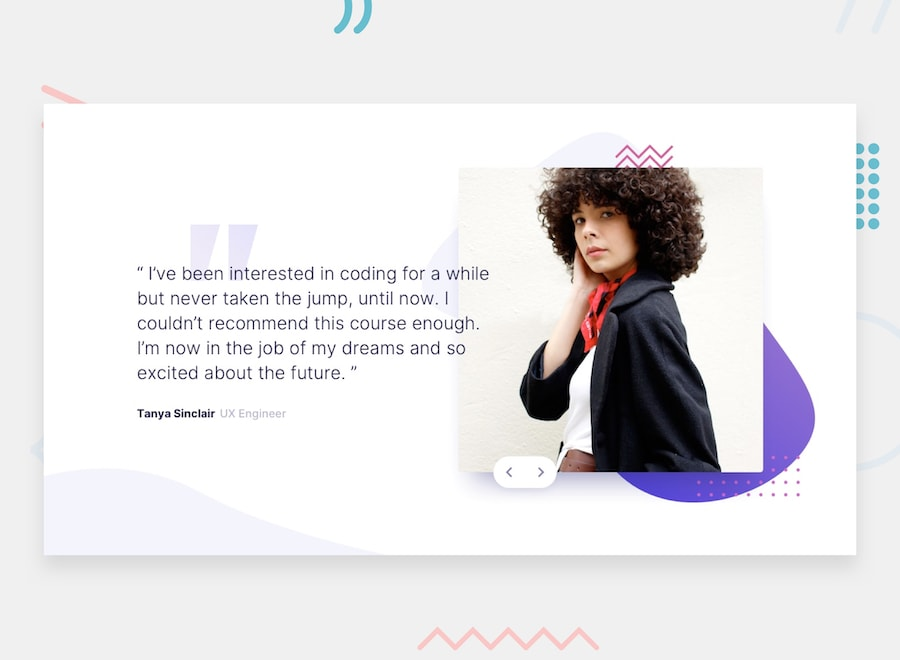

# Frontend Mentor - Coding Bootcamp Testimonials Slider



[](https://app.netlify.com/sites/coding-bootcamp-fm/deploys)

[coding-bootcamp-fm.netlify.app](https://coding-bootcamp-fm.netlify.app/)

- This is a Frontend Mentor Challenge, newbie-level. A beautiful carousel that I've really enjoyed it. Using Css Flex-box . Pure HTML CSS and JS. (No frameworks)

### Clone the repository

### Install the dependencies

```bash
git clone https://github.com/RenszCamacho/coding-bootcamp
cd coding-bootcamp
```

## Install the dependencies

```bash
#Using npm
npm install

#Using yarn
yarn
```

## Run it live

```bash
#Build dev
npm run dev or yarn dev

#Build for Production
npm run build or yarn build
```

This is deployed on Netlify.

## Tools. ⚒️

- HTML5.
- CSS3.
- ParcelJs(Bundler).
- Sass(Css Pre-precesor).
- Methodology/BEM(Css Especificity).
- Git and Github.

```

```

```

```
